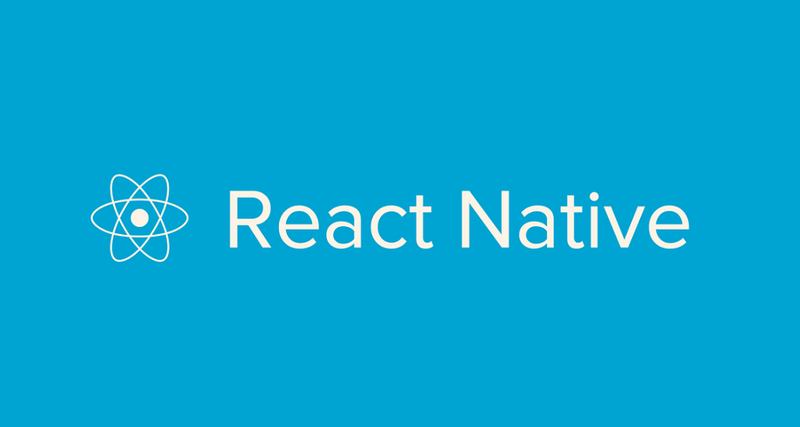

После настройки [VS Code](https://fixerteam.github.io/vscode/) можно приступить к созданию нашего первого проекта на React Native. В этой статье я опишу разницу между двумя самыми популярными способами создания проекта, которые рекомендует facebook, а также добавлю необходимые по моему мнению dev зависимости для удобного кодинга. В результате получим универсальную заготовку под следующие проекты.

Итак приступим! Идем на официальный [tutorial](https://facebook.github.io/react-native/docs/getting-started.html) и видим, что в качестве **quick start** facebook рекомендует установить [Create React Native App](https://github.com/react-community/create-react-native-app) и уже с помощью его CLI создавать проект. В таком случае нам не придется предварительно устанавливать Xcode или Android Studio. На момент написания статьи скрипт [не работает с npm 5](https://github.com/react-community/create-react-native-app/issues/233#issuecomment-305638103), потому не паримся и ставим [yarn](https://yarnpkg.com/lang/en/). Для большинства React Native проектов этого вполне хватит до того момента, пока не понадобится подключать/писать нативные модули. Переходим в папку с проектами и выполняем

```markup
create-react-native-app stub
```

По окончании генерации мы получим следующий набор файлов


Если же нам требуется добавить нативные модули/зависимости, которые не совместимы с [Expo](https://expo.io/), всегда можно сделать

```markup
yarn run eject
```

В предложенном диалоге выбираем **React Native: I'd like a regular React Native project**, пишем название приложения и получаем отсутствующие ранее папки ios и android и прочие файлы настроек. Отменить данную операцию можно только через систему контроля версий (git).


Если же мы пройдем на вкладку **Building Projects with Native Code**, то увидим последовательность шагов, которые приходилось проходить до создания CRNA. Также нам придется посетить эту вкладку, если мы сделали `eject` у проекта, созданного через CRNA, потому будь готов.

Теперь приступим к установке dev зависимостей, сделающих нашу разработку качественнее:

* [ESLint](https://eslint.org/) - cтатический анализатор кода, имеющий кучу настроек.

```markup
yarn add eslint --dev
```

* [babel-eslint](https://github.com/babel/babel-eslint) - будем использовать Babel parser для eslint, чтобы не заморачиваться с глубокой настройкой правил для различных редакций ECMAScript

```markup
yarn add babel-eslint --dev
```

* [eslint-config-airbnb](https://github.com/airbnb/javascript) - самый полный набор правил для ESLint от Airbnb

```markup
yarn add eslint-config-airbnb --dev
```

* [eslint-plugin-import](https://github.com/benmosher/eslint-plugin-import) - плагин, проверяющий секцию импортов на доступность того или иного пакета

```markup
yarn add eslint-plugin-import --dev
```

* [eslint-plugin-jsx-a11y](https://github.com/evcohen/eslint-plugin-jsx-a11y) - плагин для проверки JSX кода наших компонентов на соответствие правилам accessibility

```markup
yarn add eslint-plugin-jsx-a11y --dev
```

* [eslint-plugin-react](https://github.com/yannickcr/eslint-plugin-react) - плагин, добавляющий правила, специфичные для проектов на React и React Native

```markup
yarn add eslint-plugin-react --dev
```

* [Prettier](https://prettier.io/) - утилита для форматирования кода по es стандартам

```markup
yarn add prettier --dev
```

* [eslint-plugin-prettier](https://github.com/prettier/eslint-plugin-prettier) - плагин для интеграции prettier с eslint, чтобы не конфликтовали друг с другом

```markup
yarn add eslint-plugin-prettier  --dev
```

* [eslint-config-prettier](https://github.com/prettier/eslint-config-prettier) - настройка eslint правил, для исключения конфликтов с prettier

```markup
yarn add eslint-config-prettier  --dev
```

После установки пакетов приступим к файлам конфигурации установленных пакетов. Настройки ESLint описываются в файле **.eslintrc** или же в **package.json** в секции **eslintConfig**. Чтобы отключить ESLint для каких-либо папок и файлов используется файл **.eslintignore** или же в **package.json** в секции **eslintIgnore**. Также можно вынести настройки [Babel](https://babeljs.io/) из файла **.babelrc** в **package.json** в секцию **babel**.

Полный код проекта выложен на [GitHub](https://github.com/fixerteam/stub). Для последующих проектов можно использовать данную заготовку, сменив название проекта. Запуск Android версии (предварительно потребуется запустить android эмулятор или подключить девайс) осуществляется с помощью

```markup
yarn run android
```

Если у тебя установлен Xcode, то можно запустить iOS версию

```markup
yarn run ios
```
