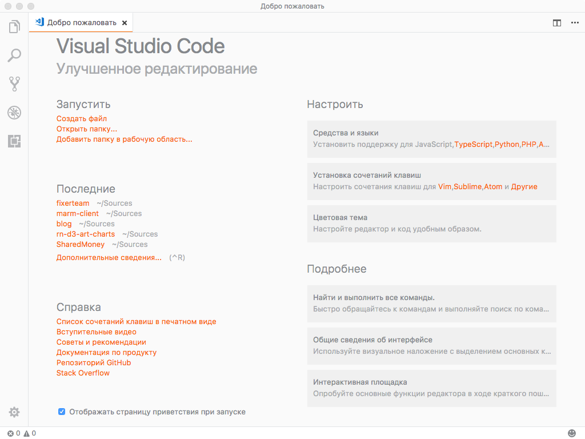

Итак ты решил посвятить себя созданию кроссплатформенных приложений на базе React Native. Для начала идем по [ссылке](https://facebook.github.io/react-native/docs/getting-started.html) на официальный сайт и настраиваем свою ОС. Затем встает закономерный вопрос где же собственно писать код? Так как любой react native проект состоит из Android кода (языки Java, Kotlin, XML, Groovy), iOS кода (языки Objective-C, Swift) и Javascript (Typescript и прочие производные), нам потребуется IDE (или несколько IDE) для полноценного написания проекта.

Для себя я выбрал связку [VS Code](https://code.visualstudio.com/) в качестве основной среды для написания javascript кода, [Android Studio](https://developer.android.com/studio/index.html) для написания нативных модулей под Android и [AppCode](https://www.jetbrains.com/objc/download/) для написания нативных модулей под iOS (в качестве альтернативы можно взять XCode от самой Apple).

После скачивания и установки VS Code готова к использованию, но для большего удобства все же рекомендую установить несколько плагинов:

* [React Native Tools](https://marketplace.visualstudio.com/items?itemName=vsmobile.vscode-react-native) Добавляет автодополнение кода для ReactNative Api, позволяет запускать CLI команды из интерфейса IDE, а также добавляет возможность дебага приложений
* [Npm Intellisense](https://marketplace.visualstudio.com/items?itemName=christian-kohler.npm-intellisense) Добавляет автодополнение названий npm модулей при написании import
* [Path Intellisense](https://marketplace.visualstudio.com/items?itemName=christian-kohler.path-intellisense) Добавляет автодополнение путей к файлам
* [Prettier - Code formatter](https://marketplace.visualstudio.com/items?itemName=esbenp.prettier-vscode) Добавляет поддержку [Prettier](https://prettier.io/) форматирования (стандарт де-факто по оформлению JavaScript/TypeScript/CSS кода)
* [ESLint](https://marketplace.visualstudio.com/items?itemName=dbaeumer.vscode-eslint) Добавляет поддержку [ESLint](https://eslint.org/) (статический анализатор кода must have)
* [Rainbow Brackets](https://marketplace.visualstudio.com/items?itemName=2gua.rainbow-brackets) Добавляет цвет к скобкам (круглым, квадратным, фигурным), благодаря чему быстрее поймешь, где какая скобка
* [Auto Rename Tag](https://marketplace.visualstudio.com/items?itemName=formulahendry.auto-rename-tag) Автоматически переименовывает парный HTML/XML тэг, в том числе и при написании JSX кода
* [Auto Close Tag](https://marketplace.visualstudio.com/items?itemName=formulahendry.auto-close-tag) Автоматически подставляет закрывающий тэг
* [Settings Sync](https://marketplace.visualstudio.com/items?itemName=Shan.code-settings-sync) Позволяет экспортировать все настройки VS Code в GitHub Gist для последующего быстрого развертывания IDE
* [TODO Highlight](https://marketplace.visualstudio.com/items?itemName=wayou.vscode-todo-highlight) Добавляет подсветку TODO,FIXME в комментариях, имеет множество настроек
* [npm](https://marketplace.visualstudio.com/items?itemName=eg2.vscode-npm-script) Добавляет возможность запуска npm команд из интефейса IDE, а также валидирует package.json файлы на корректность зависимостей
* [Language Support for Java(TM) by Red Hat](https://marketplace.visualstudio.com/items?itemName=redhat.java) Добавляет подсветку Java кода, на случай когда лень запускать Android Studio ради мелкой правки
* [Import Cost](https://marketplace.visualstudio.com/items?itemName=wix.vscode-import-cost) Добавляет в секции импорта счетчик, отображающий размер подключаемого модуля
* [Document This](https://marketplace.visualstudio.com/items?itemName=joelday.docthis) Добавляет генерацию JSDoc для классов и функций, но не генерирует полноценную документацию по проекту
* [Material Icon Theme](https://marketplace.visualstudio.com/items?itemName=PKief.material-icon-theme) Добавляет файлам в дереве проекта иконки согласно их расширению
* [Color Highlight](https://marketplace.visualstudio.com/items?itemName=naumovs.color-highlight) Добавляет подсветку цветов при написании их HEX кода ('#333')
* [Ayu](https://marketplace.visualstudio.com/items?itemName=teabyii.ayu) Весьма привлекательная тема для VS Code

После установки плагинов VS Code следует перезапустить и можно приступать к написанию проектов